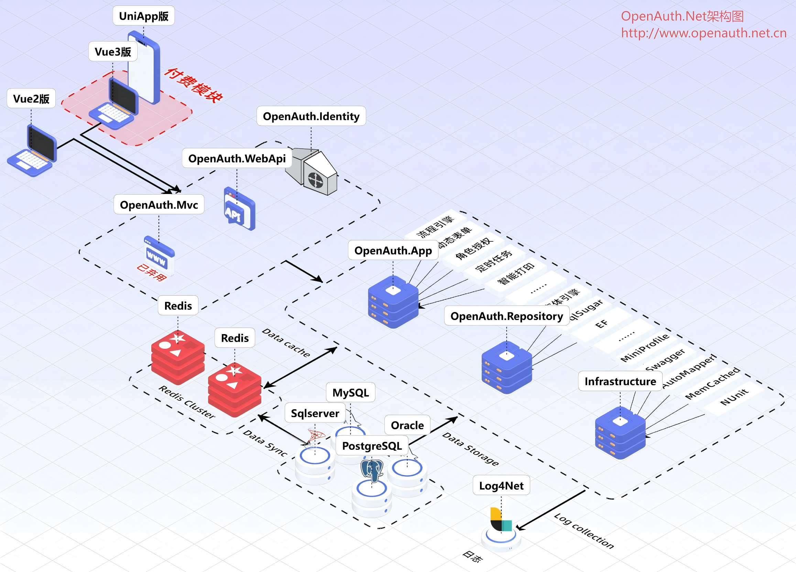

🔥.Net权限管理及快速开发框架、最好用的权限工作流系统。源于Martin Fowler企业级应用开发思想及最新技术组合（SqlSugar、EF、Quartz、AutoFac、WebAPI、Swagger、Mock、NUnit、UniApp、Vue2/3、Element-ui/plus、IdentityServer等）。核心模块包括：角色授权、代码生成、API鉴权、智能打印、表单设计、工作流、定时任务等。架构易扩展，是中小企业的首选。

  

| **官网** http://www.openauth.net.cn | **文档** http://doc.openauth.net.cn |
|---|---|

## 🏗️ 架构图

## ▶️演示直达

#### 开源版本

* 演示地址： http://demo.openauth.net.cn:1803

#### 付费订阅

* Vue3演示地址： http://demo.openauth.net.cn:1805

* 移动UniApp演示地址：http://demo.openauth.net.cn:1804 

## 📺视频教程

[OpenAuth.Net视频合集--系统结构及代码下载](https://www.bilibili.com/video/BV1Z1421q7xU/)

[OpenAuth.Net视频合集--基于RBAC体系的权限管理介绍](https://www.bilibili.com/video/BV1M9KeejENf/)

[OpenAuth.Net视频合集--企业版代码启动](https://www.bilibili.com/video/BV1KSuQebEek/)

[OpenAuth.Net视频合集--使用企业版代码生成器](https://www.bilibili.com/video/BV1JCuyeaEFp/)

[OpenAuth.Net视频合集--表单设计](https://www.bilibili.com/video/BV1dagEeFEVA/)

[OpenAuth.Net视频合集--多表代码生成](https://www.bilibili.com/video/BV1r4J3zAEsx/)

## 📸效果预览
#### 后端启动效果

#### 开源Vue2效果

#### 付费订阅效果

## 📞官方QQ交流群  

1. ***618473076*** **付费订阅专属QQ群，第一时间提供开发进度、技术咨询服务等，[如何加入请移步这里](http://old.openauth.net.cn/question/detail.html?id=a2be2d61-7fcb-4df8-8be2-9f296c22a89c)**

1. 484498493【已满】

1. 626433139【已满】

1. 566344079【2K大群】

## 💡核心功能
项目深入参考《企业应用架构模式》《重构与模式》《ASP.NET设计模式》等巨著完成每一行代码编写。主要特性：

* ✅支持最新版.Net 9
* ✅同时支持EntityFramework、SqlSugar两款最流行的ORM框架
* ✅超强的自定义权限控制，详情：[通用权限设计与实现](https://www.cnblogs.com/yubaolee/p/DataPrivilege.html)
* ✅完整API鉴权，可以控制角色可访问的API资源，及模块功能字段可见及是否返回，详情：[按角色授权API资源](http://doc.openauth.net.cn/core/apiauth.html#%E6%8C%89%E8%A7%92%E8%89%B2%E6%8E%88%E6%9D%83api%E8%B5%84%E6%BA%90) 及 [字段权限](http://doc.openauth.net.cn/core/datapropertyrule/)
* ✅可拖拽表单设计。详情：[可拖拽表单](http://doc.openauth.net.cn/pro/dragform/)
* ✅可视化流程设计。详情：[可视化流程设计](http://doc.openauth.net.cn/pro/startflow/)  
* ✅全网最好用的打印解决方案，详情:[智能打印](http://doc.openauth.net.cn/pro/printerplan/)
* ✅基于Quartz的定时任务控制,可随时启/停，可视化配置Cron表达式，详情：[定时任务](http://doc.openauth.net.cn/core/job/)
* ✅零代码动态API接口，详情：[动态API](http://doc.openauth.net.cn/core/dynamicapi/)
* ✅超好用代码生成器，可快速生成单表、主从表结构的界面
* ✅支持sqlserver、mysql、Oracle、PostgreSql数据库，理论上支持所有数据库
* ✅支持多数据源
* ✅支持多租户
* ✅支持多语言
* ✅支持自建OAuth2登录体系，详情：[登录认证及OAuth集成](http://doc.openauth.net.cn/core/identity/)
* ✅支持已有系统无缝对接本项目流程引擎
* ✅vue前端采用 vue2/3 + element-ui/plus + vform + hiprint + pinia + axios + uniapp
* ✅后端采用 .net +EF + sqlsugar + autofac + quartz +IdentityServer4 + nunit + swagger
* ✅设计工具 PowerDesigner +PDManer + Enterprise Architect

## 🔜后续
生命不息，更新不止